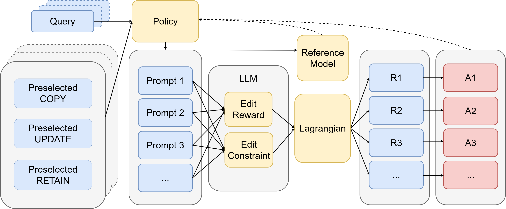

# MO-IKE

Official code for **"Towards Reliable, Generalizable, and Specific In-Context Knowledge Editing via Multi-Objective Reinforcement Learning"**, accepted to **Findings of EMNLP 2026**.

[Paper (arXiv:2608.25100)](https://arxiv.org/abs/2608.25100) | Xuzhong Wang, Maiqi Jiang, Tejal Nair, Girija Bhusal, Yanfu Zhang, Haipeng Chen

## Overview

In-context knowledge editing (IKE) updates the behavior of a frozen LLM on a target fact by prepending a constructed prompt, rather than modifying its weights — making it training-free and applicable to black-box models. Existing methods largely optimize a single objective and only make decisions over part of the prompt construction process, which leaves them unable to trade off the three objectives an edit is judged on:

- **Reliability** — does the edit succeed on the target fact?
- **Generality** — does it hold under paraphrases?
- **Specificity** — is unrelated (neighboring) knowledge left untouched?

**MO-IKE** casts prompt construction as a sequential decision process over `COPY`, `UPDATE`, `RETAIN`, and `STOP` actions, framed as a Constrained Markov Decision Process. A dynamic retriever is trained with a multi-objective, Lagrangian-shaped reward that couples edit success to explicit paraphrase-consistency and retention penalties, so the prompt is built as a structured whole rather than optimized for a single objective in isolation.

<p align="center">
  
</p>

### Results

On Llama-3.2-3B-Instruct, averaged over five seeds, MO-IKE improves over the strongest RL Baseline DR-IKE on all three axes simultaneously:

| Metric                              | DR-IKE | MO-IKE             |
| ----------------------------------- | ------ | ------------------ |
| Reliability (edit success)          | 87.1%  | **91.1%**          |
| Generality (paraphrase consistency) | 79.1%  | 77.7% (comparable) |
| Specificity (retention rate)        | 41.0%  | **63.4%**          |
| Harmonic mean                       | 61.7   | **75.7**           |

These gains hold across five frozen LLMs and four datasets, including the 311K-example UniEdit benchmark. See the paper for full results, ablations (e.g. candidate-selection and soft- vs. hard-signal filtering, illustrated in `imgs/candidate_bar.png` and `imgs/tradeoff_observation.png`), and analysis.

## Directory Structure

- **retriever.py** - The dynamic retriever (`Retriever`): a BERT-encoder policy over query/candidate/STOP embeddings, used both to sample rollouts during training and to greedily construct a prompt at evaluation time
- **train.py** - Multi-objective RL training loop for the retriever (group-relative rollouts, PPO-style clipped objective with a KL penalty against a frozen reference retriever)
- **eval.py** - Evaluation code reporting edit success (reliability), paraphrase consistency (generality), and retention rate (specificity)
- **utils/** - Utility functions for data processing, in-context example construction (`icl_utils.py`), and frozen LLM loading/inference (`llm_utils.py`)
- **Datasets/** - Contains `counterfact.json` (edit cases) and `corpus_idx.txt` (precomputed neighbor indices for COPY/UPDATE/RETAIN demonstrations) used for training and evaluation. You may evaluate MO-IKE on other datasets by replacing `counterfact.json` (and regenerating `corpus_idx.txt`) with your own data
- **imgs/** - Figures used in this README and the paper
- **requirements.txt** - Required Python packages for running the code

## Usage

### Installation

```bash
git clone https://github.com/xuzhongwm/MO-IKE.git
cd MO-IKE
pip install -r requirements.txt
```

The frozen LLM (default: `meta-llama/Llama-3.2-3B-Instruct`) is loaded from the Hugging Face Hub, so set your Hugging Face access token/ID in the `id` variable at the top of `train.py` and `eval.py` before running.

### Training

```bash
python train.py
```

### Evaluation

```bash
python eval.py
```

## Citation

Under construction — the citation will be added once the official Findings of EMNLP 2026 volume is published.
